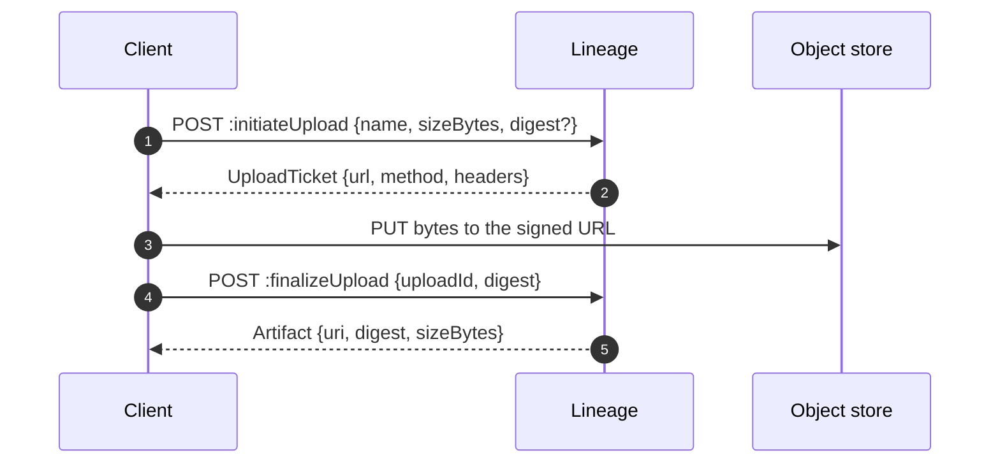

The [quickstart](/start/quickstart/) registered an artifact by reference. This time you will
upload a real file, record where it came from, and pull it back out the way a serving system
would.

Assumes a registry running on `localhost:8081`. Set an actor so the audit trail is useful:

```bash
export LINEAGE=http://localhost:8081
export ACTOR='you@example.com'
```

## 1. Create the model

```bash
curl -XPOST $LINEAGE/v1/models \
  -H 'Content-Type: application/json' -H "X-Lineage-Actor: $ACTOR" \
  -d '{
    "name": "fraud-detector",
    "description": "Card-not-present transaction scoring",
    "owner": "risk-platform",
    "labels": { "tier": "critical", "domain": "payments" }
  }'
```

Names are lowercase, and `/` is not allowed — the name has to be path-safe because it appears
in every URL that addresses the model.

## 2. Publish a version

Publish the version first, without artifacts. Bytes come next.

```bash
curl -XPOST $LINEAGE/v1/models/fraud-detector/versions \
  -H 'Content-Type: application/json' -H "X-Lineage-Actor: $ACTOR" \
  -H 'Idempotency-Key: publish-fraud-detector-1.4.0' \
  -d '{
    "name": "1.4.0",
    "description": "XGBoost → ONNX export, quarterly retrain",
    "author": "risk-platform",
    "labels": { "retrain": "2026-q1" }
  }'
```

The `Idempotency-Key` makes a retried request replay the first response instead of failing
with `already_exists`. See [Idempotency](/guides/idempotency/).

## 3. Upload the bytes

Uploading is a three-step handshake so that large files never pass through the registry when
the backend can sign a URL.



Ask for a ticket:

```bash
curl -XPOST $LINEAGE/v1/models/fraud-detector/versions/1.4.0/artifacts:initiateUpload \
  -H 'Content-Type: application/json' -H "X-Lineage-Actor: $ACTOR" \
  -d '{
    "name": "model.onnx",
    "kind": "MODEL",
    "sizeBytes": 431717888,
    "mediaType": "application/octet-stream",
    "modelFormat": { "name": "onnx", "version": "1.16" }
  }'
```

The ticket tells you which of three modes applies:

| Ticket field | Meaning |
| --- | --- |
| `url` + `method` | Signed direct upload — `PUT` the bytes straight at the object store |
| `multipart: true` + `parts` | Large file — `PUT` each part URL in order, collect the ETags |
| `streamThrough: true` + `contentUrl` | Backend cannot sign — `PUT` through the registry |

Upload, then finalize with the digest you computed locally:

```bash
DIGEST="sha256:$(shasum -a 256 model.onnx | cut -d' ' -f1)"

curl -XPOST $LINEAGE/v1/models/fraud-detector/versions/1.4.0/artifacts:finalizeUpload \
  -H 'Content-Type: application/json' -H "X-Lineage-Actor: $ACTOR" \
  -d "{\"uploadId\":\"$UPLOAD_ID\",\"digest\":\"$DIGEST\"}"
```

Finalize verifies the digest before the artifact row exists. A mismatch fails the call and
leaves no artifact behind. Full detail in
[Artifacts and uploads](/guides/artifacts-and-uploads/).

:::tip[Let a client do it]
The Python SDK and the CLI collapse all of this into one call:

```bash
lineage-cli version publish -m fraud-detector -n 1.4.0 -a model.onnx
```
:::

## 4. Record where it came from

Provenance is worth recording at publish time, when you still know the answers.

```bash
V=$LINEAGE/v1/models/fraud-detector/versions/1.4.0

curl -XPOST $V/lineage -H 'Content-Type: application/json' -H "X-Lineage-Actor: $ACTOR" \
  -d '{"relation":"trained_on","to":{"uri":"s3://data/transactions-2026-q1/"}}'

curl -XPOST $V/lineage -H 'Content-Type: application/json' -H "X-Lineage-Actor: $ACTOR" \
  -d '{"relation":"produced_by","to":{"uri":"kfp://runs/8b21c4de"}}'

curl -XPOST $V/lineage -H 'Content-Type: application/json' -H "X-Lineage-Actor: $ACTOR" \
  -d '{"relation":"derived_from","to":{"version":"1.2.0"},
       "properties":{"method":"continue_train","epochs":3}}'
```

## 5. Promote it

One stage at a time: `draft → staging → production`.

```bash
curl -XPOST $V:transition -H 'Content-Type: application/json' -H "X-Lineage-Actor: $ACTOR" \
  -d '{"to":"staging"}'

curl -XPOST $V:transition -H 'Content-Type: application/json' -H "X-Lineage-Actor: $ACTOR" \
  -d '{"to":"production","reason":"shadow eval green for 48h"}'
```

Whatever was in production is now `archived`, and both changes are one transaction.

## 6. Resolve it

What a serving system asks for:

```bash
curl -s "$LINEAGE/v1/models/fraud-detector/resolve?stage=production"
```

Every `MODEL` artifact comes back with a `storageUri` for runtimes that speak object storage
natively, and a `signedUrl` for everything else.

Or pull the whole version to a directory:

```bash
lineage-cli pull fraud-detector --dest ./model
```

## 7. Read the record

```bash
curl -s "$LINEAGE/v1/models/fraud-detector/audit?pageSize=20"
```

Every step above is in there, attributed to `$ACTOR`, with the promotion carrying your
`reason`.

## Next

- [Publishing versions](/guides/publishing-versions/) — labels, custom properties, conventions
- [Resolving a model](/delivery/resolve/) — caching, `ETag`, and what serving systems do
- [The lineage graph](/guides/lineage-graph/) — traverse what you just recorded
